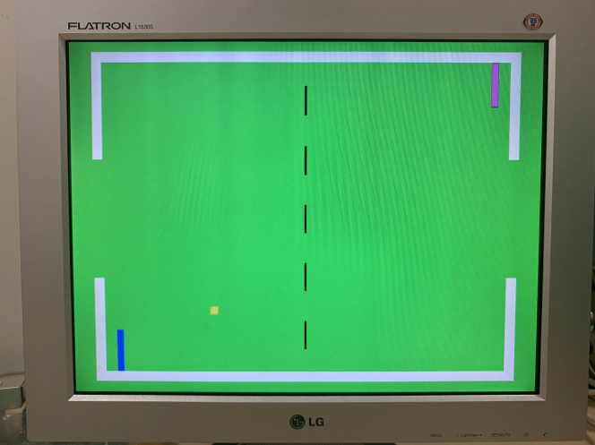
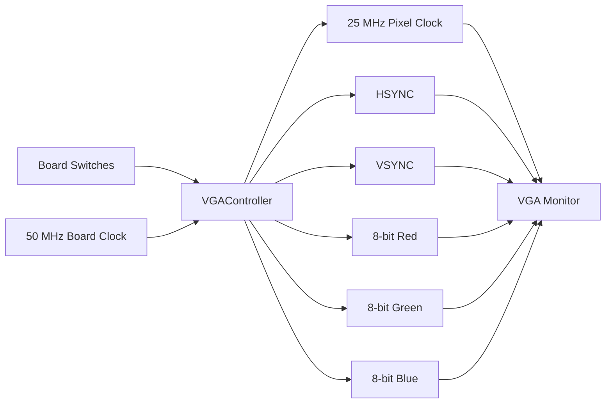
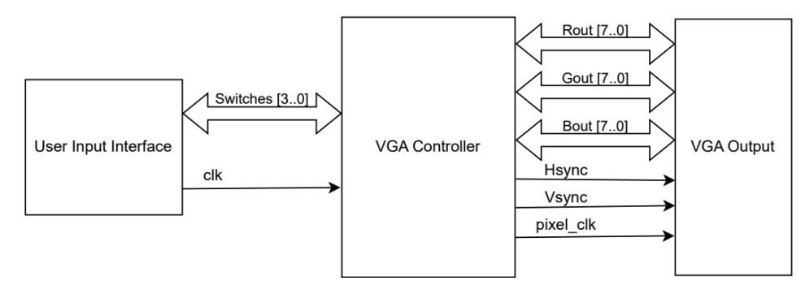
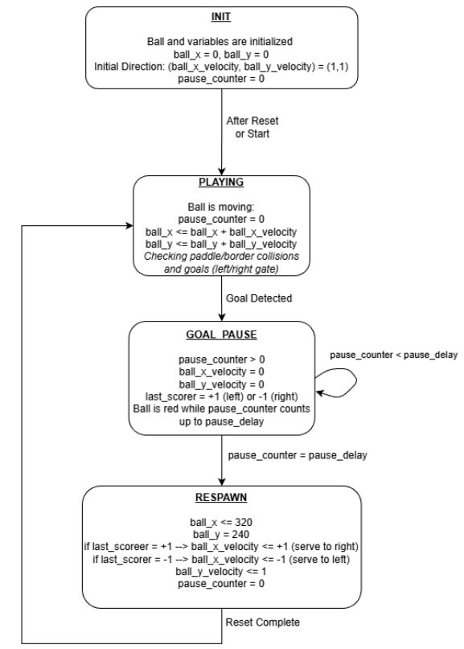
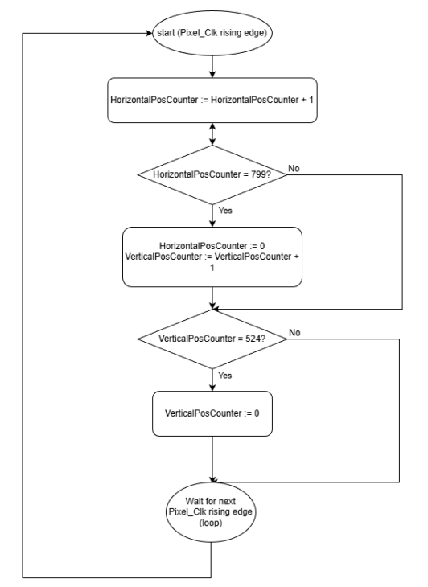
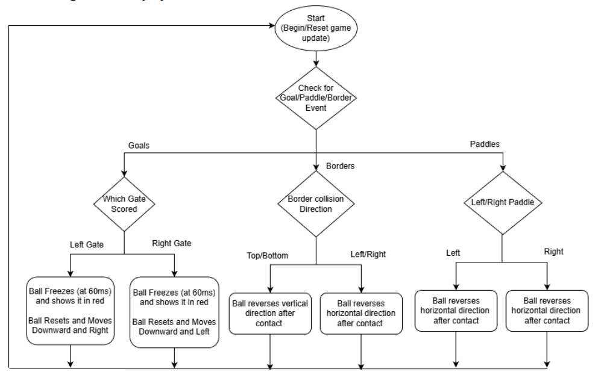
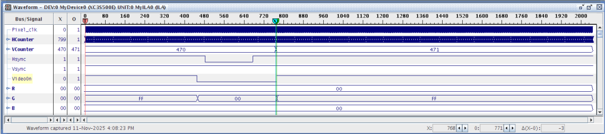
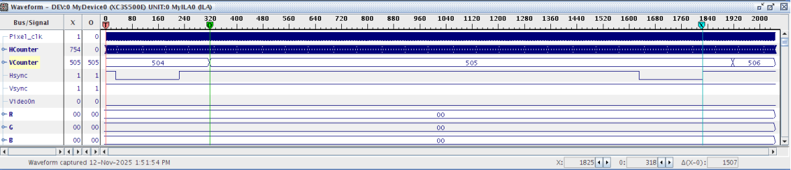

# FPGA VGA Pong Game Processor

A simple Pong-style video game processor built in VHDL for the Xilinx Spartan-3E FPGA. The system generates a 640×480 VGA display, draws the game field in real time, moves two player-controlled paddles, updates a moving ball, checks collisions, and resets the ball after a goal.



## Table of Contents

- [Project Overview](#project-overview)
- [Features](#features)
- [Hardware and Tools](#hardware-and-tools)
- [VGA Timing](#vga-timing)
- [System Architecture](#system-architecture)
- [Design Diagrams](#design-diagrams)
- [Game Logic](#game-logic)
- [Project Structure](#project-structure)
- [Results](#results)
- [How to Run](#how-to-run)
- [Future Improvements](#future-improvements)

## Project Overview

This project implements a simple video game processor for VGA output using an FPGA. The processor generates VGA timing signals, drives 8-bit RGB colour channels, and displays a Pong-style game on a VGA monitor.

The game contains:

- A green playing field
- White boundary walls
- A dashed centre line
- Two player-controlled paddles
- A moving yellow ball
- A red freeze effect when a goal is scored

The goal of the project was to gain hands-on experience with VGA timing, real-time signal generation, FPGA I/O interfacing, and VHDL-based game logic.

## Features

| Feature | Description |
|---|---|
| VGA output | Generates a 640×480 display using a 25 MHz pixel clock |
| Real-time graphics | Draws the background, borders, paddles, centre line, and ball directly from pixel coordinates |
| Player control | Two paddles move up and down using FPGA board switches |
| Ball movement | The ball moves diagonally across the field using x/y velocity signals |
| Collision handling | The ball reflects from paddles, top/bottom walls, and side walls outside the goal area |
| Goal logic | When the ball enters a goal, it freezes, turns red, resets to the centre, and serves toward the player who scored |
| Hardware debugging | Internal signals are routed to ILA for timing and signal inspection |

## Hardware and Tools

| Item | Used For |
|---|---|
| Xilinx Spartan-3E FPGA | Target hardware platform |
| VGA monitor | Displays the game output |
| Board switches | Control paddle movement |
| VHDL | Hardware description language |
| Xilinx ISE | Project design, synthesis, implementation, and bitstream generation |
| ISim / waveform viewer | Timing simulation and verification |
| ILA / ICON cores | Internal signal debugging |

## VGA Timing

The VGA controller uses a 25 MHz pixel clock for a 640×480 display. The horizontal and vertical counters include both the visible display area and the blanking intervals.

| Parameter | Horizontal | Vertical |
|---|---:|---:|
| Active display area | 640 pixels | 480 lines |
| Front porch | 16 cycles | 10 lines |
| Sync pulse | 96 cycles | 2 lines |
| Back porch | 48 cycles | 33 lines |
| Total period | 800 cycles | 525 lines |

The blanking interval is defined as:

```text
Blanking = Front Porch + Sync Pulse + Back Porch
```

The horizontal counter runs from `0` to `799`. When it reaches the end of the line, it resets to `0`, and the vertical counter increments. The vertical counter runs from `0` to `524`, then resets to start a new frame.

## System Architecture

The design is centred around a single `VGAController` module. It receives the board clock and switch inputs, then outputs VGA timing and RGB colour signals.



### Main Logic Blocks

| Logic Block | Purpose |
|---|---|
| Pixel clock divider | Converts the 50 MHz board clock into a 25 MHz VGA pixel clock |
| Horizontal/vertical counters | Track the current pixel and scanline position |
| Sync generator | Produces HSYNC and VSYNC pulses at the correct VGA timing intervals |
| VideoOn logic | Enables RGB output only inside the active 640×480 display area |
| Pixel drawing logic | Chooses the RGB value for each pixel based on the background, borders, paddles, ball, and centre line |
| Pong logic | Updates ball movement, checks collisions, handles goals, and controls respawn behaviour |
| Paddle logic | Reads switch inputs and updates paddle positions with an input delay counter |

## Design Diagrams

### System Block Diagram

The block diagram shows the main data flow of the system. The user input switches are sent into the VGA controller, which handles the game logic, pixel generation, and VGA timing signals. The RGB outputs, HSYNC, VSYNC, and pixel clock are then sent to the VGA output.



### Ball Control State Diagram

The ball control state diagram shows how the game moves between initialization, active play, goal pause, and respawn. During normal play, the ball moves based on its x and y velocities. When a goal is detected, the ball freezes, turns red, resets to the centre, and serves toward the player who scored.



### VGA Timing Process

The VGA timing process shows how the horizontal and vertical counters generate the scanning pattern for the display. The horizontal counter tracks each pixel in a line, while the vertical counter tracks each scanline in a frame.



### Ball Movement Process

The ball movement process shows how the game checks for goals, paddle collisions, and border collisions. Based on the event detected, the ball either pauses and respawns, reverses horizontal direction, or reverses vertical direction.



## Game Logic

The ball is represented as a square centred at `(ball_x, ball_y)`. The drawing logic uses `ball_x ± 6` and `ball_y ± 6`, making the ball about 12×12 pixels.

The paddles are positioned using centre y-values:

- `player1_y` controls the left paddle
- `player2_y` controls the right paddle

Each paddle has a vertical range of about 60 pixels because the drawing logic uses `player_y ± 30`.

### Scoring and Respawn

When the ball enters the left or right goal window:

1. The last scorer is stored.
2. The ball velocity is set to zero.
3. The ball turns red during a short pause.
4. The ball resets to the centre of the screen.
5. The ball serves toward the player who scored.

For example, if the left side scores, the ball resets at the centre and moves toward the right side.

## Project Structure

```text
.
├── README.md
├── VGAController/
│   ├── VGAController.vhd
│   ├── VGAControllerTest.vhd
│   └── VGAController_Implementation.ucf
└── assets/
    ├── pong-output.jpg
    ├── block-diagram.png
    ├── state-diagram.png
    ├── vga-timing-process.png
    ├── ball-movement-process.png
    ├── vga-waveform-active.png
    └── vga-waveform-blanking.png
```

## Results

### VGA Timing Simulation

The waveform below shows the VGA timing signals during active video output.



The waveform below shows the blanking interval, where `VideoOn` is low and RGB output is suppressed.



### VGA Monitor Output

The final output displays the Pong field, including the green background, white borders, dashed centre line, paddles, and moving ball.


## How to Run

1. Open the project in Xilinx ISE.
2. Add the VHDL source file from `src/VGAController.vhd`.
3. Add the constraint file from `constraints/VGAController_Implementation.ucf`.
4. Synthesize, implement, and generate the programming file.
5. Program the Spartan-3E FPGA board.
6. Connect the VGA output to a monitor.
7. Use the board switches to control the paddles.

## Future Improvements

- Add a score display on the screen.
- Add a reset button for starting a new round.
- Add paddle speed control.
- Improve collision detection so the ball reflects based on the exact paddle contact point.
- Add different ball speeds as the game progresses.
- Add sound or LED indicators for goals.
